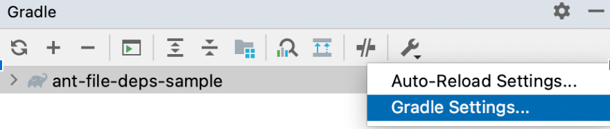
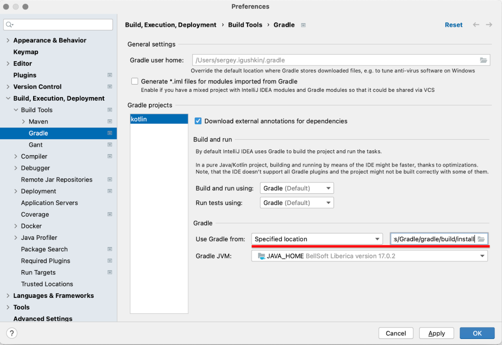

# Configuration Cache Hackathon FAQ

> See below for a list of common questions and answers about working with documentation tests and fixing issues related to the configuration cache. 
>
> For a view of the recommended workflow, please see the [Workflow](workflow.md) document.
> 
> Also, remember to check back for updates to this FAQ.

## Working with the documentation tests

> The Gradle documentation includes many code snippets. The documentation tests ensure those code snippets are valid.

### How are the documentation tests structured?

The Gradle documentation sources are under the [`subprojects/docs/`](https://github.com/gradle/gradle/tree/master/subprojects/docs) directory.

Each snippet is a subdirectory of a subdirectory of the directory [`subprojects/docs/src/snippets`](https://github.com/gradle/gradle/tree/master/subprojects/docs/src/snippets), for example, [`subprojects/docs/src/snippets/tasks/addRules`](https://github.com/gradle/gradle/tree/master/subprojects/docs/src/snippets/tasks/addRules) is a snippet. The snippet consists of at least one of groovy and kotlin gradle projects, residing in `groovy` and `kotlin` subdirectories accordingly. 

The snippet also contains test cases in the `tests` subdirectory; each test case is a file with the extension `.sample.conf`, describing how to run `gradle` and how to verify the result. The test cases are executed with [Exemplar framework](https://github.com/gradle/exemplar), though deep knowledge of the latter is not required to understand the basic flow. The path to the snippet and the name of the test case file contribute to the name of the test: path separators and `camelCasedNames` are converted to `kebab-case`, project language (groovy/kotlin) and test case name are appended. For example, `taskRule.sample.conf` in the `subprojects/docs/src/snippets/tasks/addRules` snippet produces two tests:
`snippet-tasks-add-rules_groovy_taskRule.sample` and
`snippet-tasks-add-rules_kotlin_taskRule.sample`

Some snippets put common code, for example, java sources, into a `common` subdirectory. In this case it might not be possible to import the project into IDE as is, as `common` and language-specific sources have to be merged somewhere.  Some snippets have language specific tests in “tests-kotlin” and “tests-groovy”.

### What is a `*.sample.conf` file?
A `*.sample.conf` file is a description of how to run `gradle` and how to verify the result. It is written in HOCON format and contains one or more `gradle` commands (in `executable` field) with arguments (in `args` and `flags` fields). Each can optionally contain a name of the “golden” output file (in `expected-output-file` field) to compare the output of the executed command with. The format is documented in full on the [Exemplar framework’s GitHub](https://github.com/gradle/exemplar#external-sample-conf-reference).

### What are the “sanityCheck.sample” tests? I cannot find the “sanityCheck.sample.conf”...

These tests are generated by the test harness for each test project. The test verifies that `gradle help` runs without errors and doesn’t check the output. If the configuration cache is enabled then `gradle help` is executed twice, as in all other tests: to check populating the cache and check restoring from the cache.

### How do I find the sample project that is causing a test to fail? 

Take as example a test failure message like:

`...UnexpectedBuildFailure: Gradle execution failed in /…/junit…/snippet-tasks-incremental-task_kotlin_incrementalTaskNoChange.sample`

That test case corresponds to this path:

`subprojects/docs/src/snippets/tasks/incrementalTask/kotlin`

But keep in mind that the path of the faulty project is present in every Github issue.

### How do I tell whether an issue occurs in the Kotlin or Groovy variant?  

The test name includes either `kotlin` or `groovy` in its name.

### What is the "ignore list" and how do I update it?

It is a list of names of all documentation tests that we want to fix. It lives in `subprojects/docs/build.gradle` and is named [`testsToBeFixedForConfigurationCache`](https://github.com/gradle/gradle/blob/master/subprojects/docs/build.gradle#L818). When you consider the test fixed, you should delete the string with its name from the list and include that change in your pull request.

## Running the tests locally

### How to run a test for a specific snippet?

You should find the proper `./gradlew ...` call on the Github issue. They all have a format like:

```
./gradlew :docs:docsTest \
    -PrunBrokenConfigurationCacheDocsTests=true \
    -PenableConfigurationCacheForDocsTests=true \
    --tests <test-case-name-pattern> \
    ...
```

In addition to filtering which tests to run using the `--tests` option, the suggested Gradle call sets two properties:
- `-PenableConfigurationCacheForDocsTests=true` - Runs docs tests with the configuration cache enabled.
- `-PrunBrokenConfigurationCacheDocsTests=true` - Runs docs tests that are knowingly broken when running with the configuration cache enabled. All tests described by Hackathon issues will be in the broken test list (see [`testsToBeFixedForConfigurationCache`](https://github.com/gradle/gradle/blob/8dc15820bb8471dac12555738ca31d238314b451/subprojects/docs/build.gradle#L753) in the docs build.gradle file). 

They are both required, or else you will not be running the intended tests with the configuration cache enabled.

### Where do I find the test report?

After you run the `:docs:docsTest`, the test report can be found at:

`subprojects/docs/build/reports/tests/docsTest/index.html`

### Where do I find the configuration cache report?

For a specific test failure in the test report, you can find a link to the corresponding configuration cache report in the test output:

```
 org.gradle.integtests.fixtures.executer.UnexpectedBuildFailure: Gradle execution failed in …/task-with-arguments_kotlin_projectInfoTask.sample with: 
...
Process ExecResult:
{exitValue=1, failure=null}
-----
Output:
task-with-arguments:1.0.2

-----
Error:

FAILURE: Build failed with an exception.

* What went wrong:
Configuration cache problems found in this build.

2 problems were found storing the configuration cache, 1 of which seems unique.
- Task `:projectInfo` of type `com.example.ProjectInfoTask`: invocation of 'Task.project' at execution time is unsupported.
  See https://docs.gradle.org/7.7-20220818003908+0000/userguide/configuration_cache.html#config_cache:requirements:use_project_during_execution

See the complete report at file:///…/task-with-arguments_kotlin_projectInfoTask.sample/build/reports/configuration-cache/…/configuration-cache-report.html
> Invocation of 'Task.project' by task ':projectInfo' at execution time is unsupported.
```

### Why can't I reproduce an issue using the command-line snippet provided in the Github issue?

Make sure your forked repository is in sync with the `master` branch of the Gradle repository, as support for running broken tests was implemented recently.

Also, note that `-PrunBrokenConfigurationCacheDocsTests=true` will only run tests that are in the list of broken tests. That means if you remove the test you are fixing from the list, you must stop using that option when running the tests, or else they will be skipped, leading to a successful build result, even if the test is still broken.


## Fixing Configuration Cache issues

> You can find information on troubleshooting and fixing build issues related to Configuration Cache in the [Configuration Cache documentation](https://docs.gradle.org/current/userguide/configuration_cache.html#config_cache:troubleshooting). 

### How to fix "invocation of 'Task.project' at execution time is unsupported"?

In essence, you should use an alternative service that provides similar functionality. See "Using the Project object" in the [Configuration Cache documentation](https://docs.gradle.org/current/userguide/configuration_cache.html#config_cache:requirements:use_project_during_execution). See a sample [fix](https://github.com/gradle/gradle/pull/21555/files#r948986470).

Also, the configuration cache serialization logic handles `Provider<T>` specially and correctly serializes their values; use `Property<T>` and the providers returned from `org.gradle.api.provider.ProviderFactory` to store values captured from the project or the properties.

### How to fix "cannot serialize Gradle script object references"?

This problem most commonly signals that a member of the enclosing script scope, for instance, a member of the `Project` object in the case of project scripts, is being used by a task action:

```kotlin
tasks.register("printProjectVersion") {
    doLast {
        println(version) // <---- Project.version captured by a task action
    }
}
```

A common example is when the `configurations` property or a configuration object (like `runtimeClasspath`) is used by a doLast/doFirst action. Avoid accessing such objects during execution. See a [fix](https://github.com/gradle/gradle/pull/21555/files#r948983984).

## Using an IDE

> You can use any IDE you want, or no IDE at all. While IDE-specific instructions below apply to Jetbrains' IntelliJ IDEA, you should be able to achieve something similar with other IDEs such as Eclipse and Netbeans.

### How to get IDE content assist/validation to work for a sample?

Each sample is organized as a pair of two complete Gradle projects which can be built or imported in the IDE, one with a Groovy script, the other using a Kotlin script. Importing the Kotlin version of the project gives the best code insight in the script.

You can directly open the sample from the Gradle repo as a project in the IDE. However, as it has no Gradle wrapper, the IDE may add one with some predefined Gradle version.

#### On IDEA

After opening a sample project, go to the **Gradle Settings**:



Select "Use Gradle from:" "Specified location" and choose the path to the root local Gradle installation built [from the sources](#how-to-build-a-gradle-distribution-from-the-sources-and-use-it-to-run-a-build-of-a-sample-project):



If the IDE adds a gradle/wrapper directory to the sample project, you will need to remove it to be able to run the Gradle docs tests. As an alternative, consider copying the sample project to a location outside the Gradle repository.

### How to run an imported snippet project to reproduce the failure?

You must run `gradle <task>` under the language-specific project while making sure you specify both `--configuration-cache` and `--rerun-tasks` options, or else no configuration cache problems may be reported. 

```
cd subprojects/docs/src/snippets/buildCache/cacheable-bundle-task/groovy
gradle :bundle --configuration-cache --rerun-tasks
```

On IDEA, running the task from the "Gradle" view does not do that by default, so you must either modify the "Run configuration" to do so or run the `gradle` command via the `Run Anything` IDE action where you can explicitly pass the `--configuration-cache` parameter. 


## Other topics

### How to build the docs locally so I can find and fix consistency issues with the prose?

```
./gradlew -PquickDocs stageDocs
```

The documentation will be available at:

`subprojects/docs/build/docs/userguide/getting_started.html`

See also "User manual" section in the [README.md](https://github.com/gradle/gradle/blob/master/subprojects/docs/README.md#user-manual) file.

### How is Gradle executed under the test?

The snippet test runs the gradle distribution built from sources. For each command in the `sample.conf` file, the gradle runs twice with the specified flags and args in the project’s directory or in its subdirectory if this is specified in the `sample.conf` file. Only the output of the first run is considered when checking with the “golden” output file, the second run only verifies that the configuration cache entry can be reused. The `--rerun-tasks` flag is added to the second run.


### How to build a Gradle distribution from the sources and use it to run a build of a sample project?

Choose a file system path, relative to the Gradle repository root, to install the distribution to; Let’s assume it’s build/install. In the Gradle project, run:

```
./gradlew install -Pgradle_installPath=build/install
````

This will build and install the distribution into that location.
In the sample project, run the executable from that installation:

```
/path/to/gradle/project/build/install/bin/gradle <task>
```

*Note that building Gradle locally should not be necessary to address Hackathon issues.*

### What if my question does not show here?

Join us on the [Gradle Community Slack](https://join.slack.com/t/gradle-community/shared_invite/zt-1bbiqbuxw-CgB0NeNaK_zuDMEa71A60Q) [#configuration-cache](https://app.slack.com/client/TA7ULVA9K/C013WEPGQF9) channel for support. 

